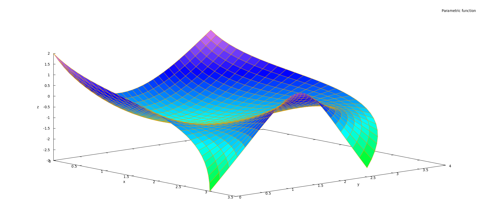
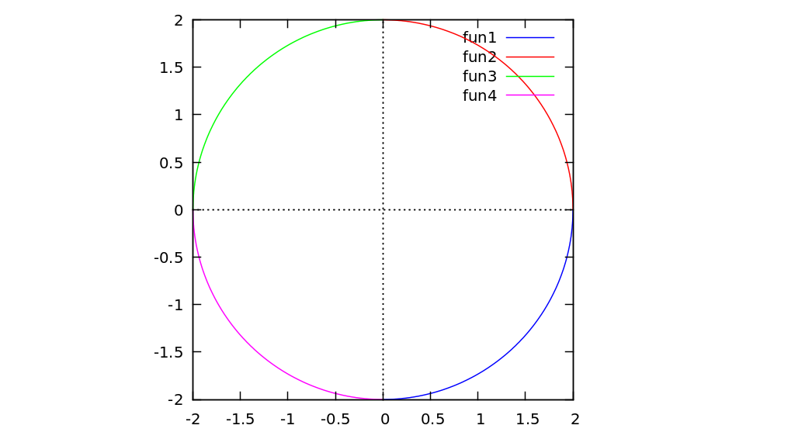
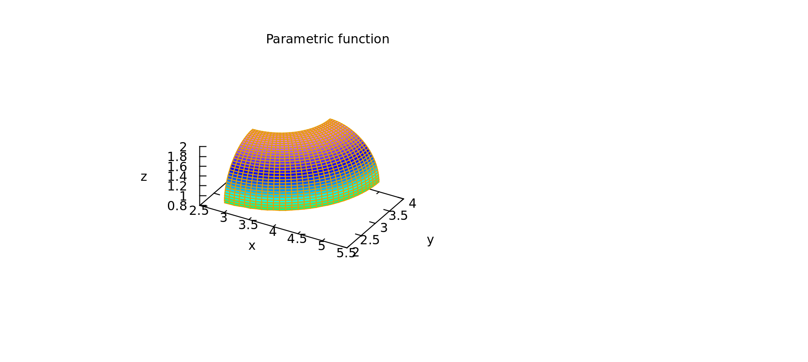

# Maxima-bezier
Maxima library for working with Bezier functions

### Homepage of Maxima

http://maxima.sourceforge.net/

Maxima is a computer algebra system that is open source.

### Homepage of wxMaxima

https://sourceforge.net/projects/wxmaxima/

wxMaxima is a cross-platform graphical front-end for Maxima.

(The files with the wxmx extension can be opened in wxMaxima.)

### Author

[Tor Olav Kristensen](http://subcube.com)
